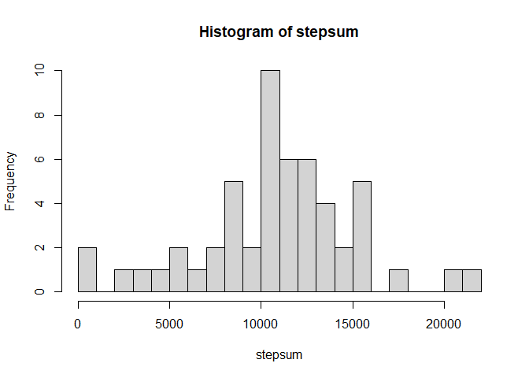
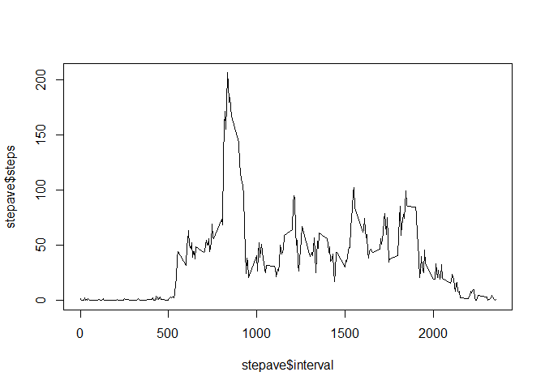
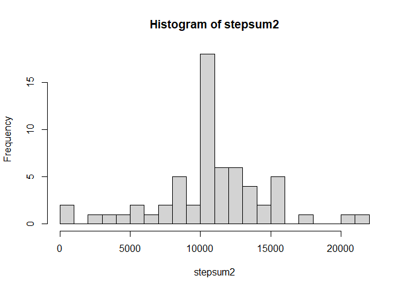
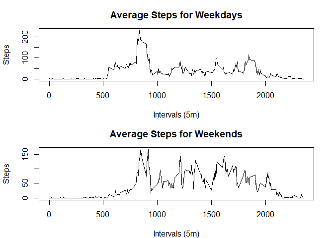

## Loading and preprocessing the data


```r
data <- read.csv("activity.csv")
```

## What is mean total number of steps taken per day?

#### In tapply, the second argument is data\$date, which is to convert the date into factors, and sum the steps according to each subset of each factor.


```r
stepsum <- tapply(data$steps, data$date , sum)
hist(stepsum,breaks = 30)
```

<!-- -->

```r
mean(stepsum, na.rm = TRUE)
```

```
## [1] 10766.19
```

```r
median(stepsum,na.rm=TRUE)
```

```
## [1] 10765
```

## What is the average daily activity pattern?

#### aggregate() is useful for time series analysis


```r
stepave<-aggregate(steps~interval,data = data,FUN = mean,na.rm=TRUE)
plot(stepave$interval,stepave$steps, type = "l")
```

<!-- -->

#### which interval has the maximum of steps?


```r
stepave[which.max(stepave$steps),]
```

```
##     interval    steps
## 104      835 206.1698
```

## Imputing missing values


```r
sum(is.na(data))
```

```
## [1] 2304
```


```r
data2 <- data
for(x in 1:17568) {
  if(is.na(data2[x, 1])==TRUE) {
    data2[x, 1] <- stepave[stepave$interval %in% data2[x, 3], 2]
  }
}
```


```r
stepsum2 <- tapply(data2$steps, data$date , sum)
hist(stepsum2, breaks=30)
```

<!-- -->

```r
mean(stepsum2)
```

```
## [1] 10766.19
```

```r
median(stepsum2)
```

```
## [1] 10766.19
```

## Are there differences in activity patterns between weekdays and weekends?


```r
data2$date<-as.Date(data2$date)
```
#### if else logic to analyze whether it's weekday or weekend.

```r
isweekday<-function(a){
  if (weekdays(a) %in% c("Saturday", "Sunday"))
    return("weekend")
  else
    return("weekday")
}
```
#### make a new row of daytype

```r
data2$daytype<-mapply(isweekday,data2$date)
```
#### subset weekday and weekend data

```r
weekdayData <- data2[data2$daytype=="weekday", ]
weekendData <- data2[data2$daytype=="weekend", ]
```
####calculate mean of each interval of weekday and weekend data

```r
weekdayMean <- aggregate(steps ~ interval, weekdayData, mean)
weekendMean <- aggregate(steps ~ interval, weekendData, mean)
```

####create the plot

```r
par(mfrow=c(2, 1), mar=c(4, 4.1, 3, 2.1))
plot(weekdayMean$interval, weekdayMean$steps, type="l",
     main="Average Steps for Weekdays",
     xlab="Intervals (5m)", ylab="Steps")
plot(weekendMean$interval, weekendMean$steps, type="l",
     main="Average Steps for Weekends",
     xlab="Intervals (5m)", ylab="Steps")
```

<!-- -->
